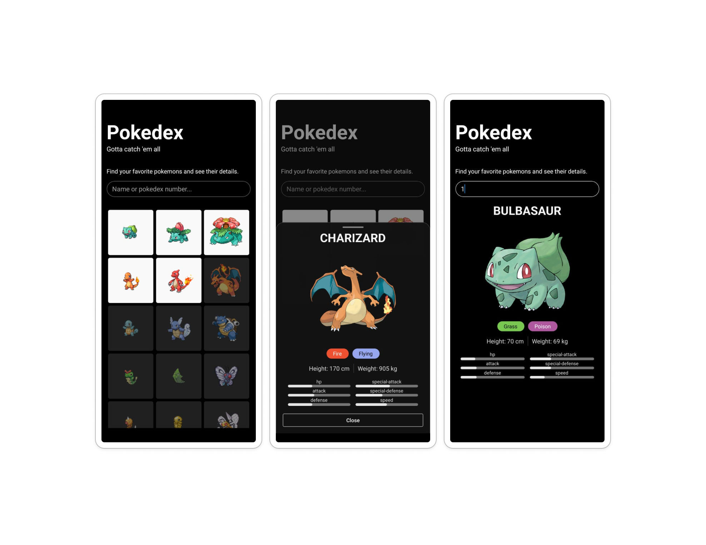

# Pokédex App

A React Native application that allows users to browse and search for Pokémon using the [PokéAPI](https://pokeapi.co/). Keep track on the Pokemons you have seen.

Built with Expo, React Native, and Tailwind CSS.



## Features

- Browse a list of Pokémon with infinite scrolling
- Search for Pokémon by name or ID
- View detailed information about each Pokémon
- Responsive layout for different screen sizes

## Installation

Follow these steps to set up the project locally:

```bash
# Clone the repository
git clone https://github.com/jose-garzon/pokedex-native
cd pokedex-native

# Install dependencies
npm install
```

## Running the App

```bash
# Start the development server
npm run start
```

After running the start command, you'll see options to run the app on different platforms:

### Running on iOS

```bash
# Press 'i' after starting the development server, or run:
npm run ios
```

### Running on Android

```bash
# Press 'a' after starting the development server, or run:
npm run android
```

### Running on Web

```bash
# Press 'w' after starting the development server, or run:
npm run web
```

### Expo Go

You can also run the app on your physical device using the Expo Go app:

1. Download Expo Go from the App Store or Google Play Store
2. Scan the QR code displayed in the terminal after running `npm run start`

## Testing

The application includes unit tests using Jest and React Testing Library.

```bash
# Run all tests
npm run test

# Run tests with coverage report
npm run test:coverage
```

## Project Structure

The project follows a modular architecture to separate concerns and organize code effectively:

### Modules Folder

The `modules` folder contains the business logic and code for different entities of the application. Currently, the only module is `Pokemon`. This structure helps encapsulate the functionality of each entity.

Each module typically includes:

- `adapters.ts`: Custom hooks for data fetching and state management
- `services.ts`: API service functions
- `types.ts`: TypeScript interfaces and types
- `components/`: UI components specific to the module
- `*.screen.tsx`: Screen components that compose the UI

### App Folder

The `app` folder works solely as a router, handling navigation concerns. It uses Expo Router for file-based routing, keeping navigation logic separate from business logic.

## Technologies Used

- [Expo](https://expo.dev/) - React Native framework
- [React Native](https://reactnative.dev/) - Mobile app framework
- [Tailwind CSS](https://tailwindcss.com/) via [NativeWind](https://nativewind.dev/) - Styling
- [React Query](https://tanstack.com/query) - Data fetching and caching
- [Gluestack UI](https://gluestack.io/) - UI component library
- [Jest](https://jestjs.io/) & [React Testing Library](https://testing-library.com/docs/react-testing-library/intro/) - Testing
- [MSW](https://mswjs.io/) - API mocking for tests

## License

[MIT](LICENSE)
